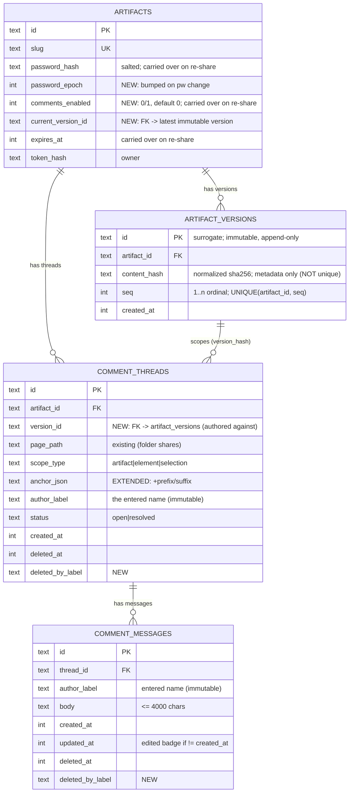

# ✨ Universal commenting for shared HTML documents

## Overview

Let anyone who can view a shared HTML document leave comments — on a **component** (element) or a **text selection**, through one universal in-page tool — without needing a toss account/token. Commenters identify with a self-entered **display name**; if the share is **password-protected** they pass its view password to get in (name-only on open shares). Comments are stored server-side, tied to the published artifact **and its content version**, and retrievable via the toss CLI/API. When a new version is deployed, only the latest version's comments are shown by default; older versions' comments are retained and listable via a version parameter.

This is a **redesign** of the existing (rolled-back) share-page comment feature, not an extension — see "The redesign reframe" below.

## 🔄 Revision — 2026-06-06 (model finalized; supersedes conflicting text below)

Three things changed after a working spike on the real `avpn-onboarding-prototype.html` (see `examples/snapshot-comments/`). **Where earlier sections conflict, this block wins.**

**1. Password is OPTIONAL, not required.** Identity = the entered **name** (always). The **document password is only a view gate when the share has one**; comments are enabled per-share by **`comments_enabled` alone**, independent of whether a password is set. Open (no-password) shares can have comments (name-only) — as reachable as the document itself. → Supersedes the "password **required**" stance in the reframe table, decision #4 (gate on `comments_enabled` only), decision #5 (`--comments` does **not** require `--password`), and decision #11 (removing a password no longer blocks comments).

**2. Anchoring = COMPONENT-ANCHORED on the live DOM (snapshot rejected).** We built and rejected a snapshot-on-comment approach: a frozen image kills **text selection** and points at a *picture*, not the component. The chosen model anchors to the **live element** and stores its **state**, so text stays selectable and the comment is semantic + agent-actionable. `anchor_json` holds:
```
{ kind: "element" | "selection" | "page",
  locator: { id, testid, aria, role, tag, selector, ordinal },   // stable signals first; HASHED CLASSES EXCLUDED (React)
  state:   { text, outerHTML(<=4 KB), rect },                     // "the state of the component"
  view:    { url, navLabel, heading },                           // which screen/state it was on
  quote:   { prefix, exact, suffix } }                           // selections only (W3C TextQuoteSelector)
```
Re-display runs a **recovery ladder**: `id`/`testid`/`aria` → `selector` (confirm by text) → `quote`/text search → **orphan-but-keep**, showing the stored `state` + `view` ("page changed — it referred to …"). The `state` block is both the orphan safety-net and the structured payload for the API / Send-to-Claude. → Supersedes decision #9 and Phase 3's "prefix/suffix only."

**3. UI = explicit comment mode + on-demand re-locate (dissolves the pre-layout-pin CRITICAL).** Comments live in a **side panel**; the page is browse-by-default; an explicit "Comment" mode does hover-highlight + click-to-pick (or text-select). Clicking a comment **re-locates and flashes the live element on demand** — no always-on pins painted pre-layout, so the frontend-races CRITICAL (#5) is **largely dissolved**. The reposition/`ResizeObserver` machinery is only needed if we later add persistent on-page pins. The widget is a **Shadow-DOM overlay** → no CSS/JS collision with the content (incl. a prototype's *own* comment tool, verified on avpn).

**Already built (earlier session) vs remaining — this is the real delta:**

| Requirement | State | Remaining |
|---|---|---|
| #1 DB-tied (threads/messages, both backends) | ✅ built | store the richer component `anchor_json` from the new widget |
| #2 name + optional password, no token (grant JWT, `author_label`, anyone-edits, opt-in toggle, backward-compatible) | ✅ built | none server-side; new widget reuses the name/grant flow |
| #4 programmatic retrieval via a toss skill | 🔶 partial | `api.getComments(id)` + `toss comments <id> [--json]` (extend `comments.ts`) + **SKILL.md** (zero comment coverage today) |
| #5 versioned, latest-only | 🆕 new | `artifact_versions` + `version_id` on threads + re-share `--force` guard + latest-only serve/query |
| Universal component tool (widget) | 🆕 new | port the spike's component-anchor capture into the real widget on **both** backends, POSTing to the existing routes |

**Build order (slices — `toss-test`, TDD, committed one by one, backward-compatible):**
1. **Versioning foundation** — `artifact_versions`, `version_id` on threads, re-share guard, latest-only serve/query. *Foundation: everything ties to a version.*
2. **Comment retrieval API + skill** — `toss comments <id> --json` + `SKILL.md` (#4). Small, self-contained.
3. **Widget component-anchor upgrade** — both backends: capture `{locator,state,view,quote}`, recovery ladder, orphan, explicit comment mode.

Built migrations already present: worker `0007_comments_enabled`, `0008_password_epoch`; vercel `0005_comments_enabled`, `0006_password_epoch`.

## ⚡ Enhancement Summary (deepened 2026-06-05)

Deepened with 9 expert review agents (security, architecture, data-integrity, data-migration, performance, simplicity, TypeScript, frontend-races, agent-native-parity) + a deep research dive on anchor recovery. They surfaced findings that **change the plan**, not just add detail. Highest-signal first.

### 🔴 Premise correction (reverses the retention decision)
- **There is no "25 MB per-artifact" storage budget.** That constant is a per-upload `Content-Length` guard (`worker:1540/1650`, `vercel:553/652`); storage is Cloudflare KV / Vercel Blob with **no per-artifact cap**. The entire bounded-10 / prune / `410` retention design was solving a non-existent constraint. **The retention decision is void** — see the pivotal decision below.

### 🔴 Critical corrections baked into the plan
1. **Grant-JWT conflation (security + architecture, CRITICAL).** The reused artifact JWT is byte-identical to the legacy view token minted for *every* artifact at share time (`/a/:id?t=`). As written, anyone holding any legacy view link could call the comment API **without the password** — defeating the core premise. Also `verifyJWT` never checks `alg`. **Fix:** a *distinct* comment grant with claims `{aud:"comment", pwd_epoch, exp≤24h}`, a separate `requireCommentGrant` verifier, and `alg==="HS256"` assertion. Grant need NOT be version-scoped (version is validated from the POST body).
2. **Epoch invalidation is structurally broken (security + data, CRITICAL).** The password session cookie is a static `toss_pwd_<slug>=1` matched by substring `includes()` (itself a forgery vector). Decision #11 can't work until the cookie carries the epoch (parsed exactly, not `includes()`) AND the grant embeds `pwd_epoch`.
3. **Password hash is fast SHA-256 salted only by the public artifact id (security, HIGH).** Crackable offline on DB leak; this plan makes the password gate *writable* data. **Fix:** PBKDF2 via WebCrypto (available on both edges) or, minimum, a server-side secret pepper.
4. **SQLite can't make the existing `NOT NULL` token columns nullable (data-migration, CRITICAL).** D1 has no `ALTER COLUMN`; relaxing `NOT NULL` needs a full table rebuild. But the comment tables are **empty** (rolled back) → simplest fix: write a sentinel (`''`) into the legacy `*_token_hash` columns and drive identity off `author_label`; new columns must be **nullable/defaulted**. Stop describing them as "make nullable."
5. **Pins paint before the 239 KB document lays out → misattributed feedback (frontend-races, CRITICAL).** The injected script is synchronous before `</body>`; `getBoundingClientRect` is captured once, pre-reflow, and **never recomputed** (no scroll/resize/Mutation listeners). A pin can end up next to unrelated content. **Fix:** gate first render on `readyState==='complete'`/double-rAF, add a rAF-throttled `repositionAnchors()` on scroll/resize + `ResizeObserver` + debounced `MutationObserver`, plus listener/interval teardown (leaked 2 s polls otherwise self-DoS the API).
6. **Owner-token API is read-only (agent-native, CRITICAL for req #4).** All write routes require the password grant, so cloud automation with the owner token can read but not post/reply/resolve/delete. **Fix:** accept the owner token on every comment route (it already passes the `token_hash` owner check); exempt `Authorization: Bearer` from the Origin/CSRF gate; add `toss comments reply|resolve|delete` and a `GET /artifacts/:id/versions` + `toss comments versions`.

### 🟠 Important, baked in
- **Notifications subsystem is silently in-scope (simplicity).** The shipped notification bell/unread tracking (`worker:321-664`) is coupled to the token identity being removed; "unread per anonymous name" is ill-defined. **Decision: cut notifications from v1** (explicitly, so it's planned not discovered).
- **Most of Phase 3 already exists (simplicity).** Page/element/selection capture, optimistic create/reply/resolve/edit, soft-delete, "edited" badge are already implemented. Phase 1 is mostly *swapping the identity surface* (token textarea → name prompt), not building a comment tool.
- **Polling cost (performance).** The 2 s poll fetches all-pages/all-versions full payloads (~120 D1 reads/min/viewer). **Fix:** a `digest` endpoint (max(updated_at)+count, one indexed query), raise interval to 10-15 s, fold the liveness check in, version-scope the query. Add index `(artifact_id, page_path, version_hash, created_at DESC)` in the same migration that adds `version_hash`.
- **Vercel double Blob read per HTML view (performance).** `serveArtifact` reads the body twice; collapse to one and denormalize current `storage_key` so the hot path needs no extra join.
- **`@ts-nocheck` Vercel template (TypeScript).** Vercel is excluded from `tsc` — "tsc clean" is a false signal for half the work. Make the anchor a discriminated union, move `api.upload()` to an options object (it's already 5 positional args), add a typed error envelope `{error, code}` for the new 404/401/409/410, and type the server↔injected-script wire contract.
- **`artifact_versions.content_hash` can't be a global PK (data-integrity + migration).** Identical content across artifacts collides; use a surrogate PK + `UNIQUE(artifact_id, content_hash)` + `UNIQUE(artifact_id, seq)`. (Moot if versioning collapses to a column — see pivotal decision.)
- **Vercel `migrate.js` re-runs all SQL & splits on `;` (data-migration).** New migrations must be single-statement, idempotent (`IF NOT EXISTS`), no triggers/`DO $$` blocks; backfill must be lazy app-code with a legacy-flat-key serve fallback, never SQL.
- **Re-share + prune are non-atomic across storage+rows (data-integrity).** Write storage before committing the row; commit version-row + pointer atomically (D1 `batch()` / Postgres txn). Add `artifact_versions` to the revoke cascade.
- **IP capture (security + data).** No column, retention, or deletion policy specified; IP is PII and could leak via the grant-readable read API. **Fix:** add an explicit column, store truncated/hashed IP, never return it on grant-auth reads, short TTL — or drop IP from v1.
- **A concrete, implementable anchor-recovery spec** (W3C TextQuote prefix/suffix + 4-step ladder + windowed Bitap + orphan-don't-drop + version scoping) is now available for Phase 3; the fuzzy ladder can be **deferred** to exact-match+orphan for v1 (version-pinning already neutralizes most cross-version drift).

### 🟢 The pivotal decision — ✅ RESOLVED: Option A (append-only immutable records)
Resolved 2026-06-05: comments are tied to the version they're made on; a new version hides prior comments (not carried forward); old versions' **comments** stay viewable later (listing comments, **not** re-rendering old bodies — deferred). Versioning is an **append-only `artifact_versions` table of immutable metadata rows** (no per-version bodies — content is overwritten in place) + a `current_version_id` pointer + a `version_id` stamp on comments + a filter. **Settings (password / expiry / comments-enabled) carry over on re-share.** A **fail-closed re-share guard** (decision #6a) blocks a no-op re-share when comments exist unless `--force`. Full detail under "Pivotal scope decision" below.

## Problem Statement / Motivation

The shipped comment feature (PR #3, since rolled back on production) had two fatal problems:

1. **Wrong default UX:** comments were coupled to `MULTI_TENANT` and injected on **every** HTML page, forcing a comment widget onto every share.
2. **Wrong audience:** commenting required a personal toss token, so only registered team members could comment — not the clients/reviewers the documents are shared with.

The desired product is the opposite: comments are an **opt-in property of a specific share**, and **anyone with the document password** can participate using just a name. Documents (e.g. `avpn-onboarding-prototype.html`) are shared with external reviewers who should be able to comment on components and copy directly on the page, with feedback tied to the exact version they reviewed.

## The redesign reframe (read first)

A comment subsystem already exists on both backends and makes the **opposite** decision on nearly every axis this plan requires. The two cannot coexist on the same tables/routes. **Decision: replace the token model.** This is safe because the feature is not in production use (rolled back; production `toss-team` has no real comment data).

| Axis | Shipped today | This plan |
|---|---|---|
| Commenter identity | toss **token** (Bearer) → `author_token_hash` | view **password** + display **name** → `author_label` |
| Edit/delete rights | author or admin only | **anyone with the password** (trust-based, small group) |
| Gating | `MULTI_TENANT === 'true'` (404 otherwise) | per-share **`comments_enabled` + password set** |
| Password requirement | none (works on any viewer-JWT artifact) | **optional** — name always; password only when the share has one; comments gated by `comments_enabled` (revised 2026-06-06) |
| Anchoring | token-era page/element/selection | **component-anchored** (locator + state + view), text-selection second gesture, snapshot rejected (revised 2026-06-06) |
| Versioning | none — re-share overwrites content in place | content-hash **versions**, `?__toss_v=`, latest-only by default |

Origin references: shipped routes at `src/templates/worker/src/index.ts:1747-2032` and `src/templates/vercel/api/index.ts:728-946`; RFC `docs/rfcs/share-page-comments.md` (describes the token model — supersede it).

## Decisions (resolving the open forks)

These resolve every fork raised in brainstorming and the spec-flow gap analysis. **Bold = the one decision that most needs your sign-off at review.**

1. **Identity:** display **name** (free-text, captured immutably per comment as `author_label`) + the share's **view password**. The name is a *claim, not an identity* — never render it as "verified." Capture client IP + timestamp **server-side only** (`CF-Connecting-IP` / Vercel `request.ip`) for soft-moderation.
2. **Comment grant (auth path):** reuse the existing **artifact-scoped JWT** pattern (`X-Toss-Viewer`). Issue it in `serveArtifact` **only after the password gate passes and `comments_enabled`** (today it's issued under `MULTI_TENANT`). The client sends it as a header on comment API calls. This solves the cookie-path problem (`toss_pwd_<slug>` is `Path=/s/:slug`, comment routes are `/artifacts/:id/...`) and gives CSRF protection (custom header forces preflight).
3. **Edit/delete:** anyone holding the comment grant (i.e. the password) can edit/delete **any** comment. Made safe via **soft-delete + tombstone**, immutable `author_label` across edits, an "edited" badge, and recording the editor/deleter label. (Full edit-history revisions table = follow-up, not v1.)
4. **Gating:** add `comments_enabled` to `artifacts`; inject UI + allow comment routes **iff `comments_enabled`** — independent of whether a password is set, so open shares can have comments. Fully decoupled from `MULTI_TENANT`. *(Revised 2026-06-06: dropped the `password_hash IS NOT NULL` requirement.)*
5. **Enable paths:** `toss share <file> --comments` (works **with or without** `--password`) and toggle later via `toss comments <slug> on|off` → `PATCH /artifacts/:id/comments` (owner/admin auth, reusing the `token_hash` owner check). *(Revised 2026-06-06: `--comments` no longer requires `--password`.)*
6. **Versioning (Option A — append-only immutable version records):** versioning is an **append-only `artifact_versions` table** — one **immutable** row per share/re-share (`id, artifact_id, seq, content_hash, created_at`), never updated after insert; `artifacts.current_version_id` points at the latest. **Content is overwritten in place** (no content-addressed storage, no per-version bodies retained); `content_hash` (normalized, single-pass) is stored on the version row as **metadata only**, used to detect "did the content change?". `content_hash` is **not** unique per artifact (a `--force` re-share can repeat identical content as a new row) — `UNIQUE(artifact_id, seq)` is the ordinal; there is no `UNIQUE(artifact_id, content_hash)`. Each comment thread carries the **`version_id`** it was authored against; the default view filters to `version_id = current_version_id`, so a new version **hides** prior comments (retained as a *list*, not a re-rendered old body). **Settings carry over:** `password_hash`, `expires_at`, and `comments_enabled` live on the mutable `artifacts` row and are **preserved on re-share** (never reset implicitly) — not snapshotted per version.
6a. **Re-share trigger + fail-closed guard.** A new version is minted when content changes; the guard protects comments on no-op re-shares. Detect change by comparing the upload's `content_hash` to the current version's.
   - **Content changed →** new immutable version; prior comments move to history. (Normal path.)
   - **No content change, no comments →** idempotent no-op (no new version).
   - **No content change, comments exist → FAIL** (exit non-zero, nothing published): *"No content change, but this version has N comments. Publishing a new version would hide them. Re-run with `--force`."* `--json` emits `{error:"comments_present_no_change", comment_count:N, hint:"--force"}`.
   - **`--force` →** publish a new version regardless (even on identical content); prior comments move to history.
   Behavior is **uniform across interactive and non-interactive** (agent/CI) — a single `--force` override, no prompt to hang on. The skill documents `--force`/`--json` only once the versioning code ships (documenting an unimplemented flag is exactly the loop we're avoiding).
7. **Historical comments (later):** old versions' comments are retained; viewable via `?__toss_v=<seq>` / `toss comments list --version <seq>`, which **lists that version's comments only** — it does **not** re-render the old document body (deferred Option B). Use the namespaced `__toss_v` param so it never clobbers the document's own query string.
8. **Version-pinned writes:** the served page embeds its `version_id`; comment POSTs carry it; the server attaches the comment to that version and **rejects (409) any write whose `version_id` ≠ `current_version_id`** (prevents commenting into a superseded version mid-redeploy).
9. **Anchor robustness:** extend `anchor_json` with **32-char `prefix`/`suffix`** (W3C TextQuoteSelector). On the latest version, run a Hypothesis-style recovery ladder; on failure **orphan the comment (keep it, detach the pin, badge it) — never silently drop it.**
10. **Read access:** readers = anyone with the view password (page) ; **programmatic/cloud API auth = owner toss token** (Bearer), version-scoped (default latest). Never public; `Vary: Cookie, Authorization`; comments fetched client-side after the gate, never inlined into gated HTML.
11. **Password lifecycle:** changing the password **bumps a session epoch** (`toss_pwd_<slug>=<epoch>`) to invalidate stale sessions. *(Revised 2026-06-06: since open shares may have comments, removing a password no longer blocks/auto-disables comments — they remain, gated by `comments_enabled`, as reachable as the now-open document.)*
12. **Disable/enable:** disable = **hide + retain** (`comments_enabled=0`); re-enable restores existing threads.
13. **Folder shares:** **folder versioning is out of scope for v1** (`--id` is blocked for directories; `src/commands/share.ts:107-110`). Folder shares may still have comments scoped per file via the existing `page_path`, but without versioning. Single-file shares get the full versioning behavior.

### Version retention scope (~~decided: bounded, last 10~~ — VOID, premise was false)

> **⚠️ Superseded by the deepen pass.** This section assumed a "25 MB-per-artifact budget with no GC." **That budget does not exist** — the `25*1024*1024` constant is a per-upload `Content-Length` guard, not a storage cap (KV/Blob are uncapped per artifact). So bounded-10 retention + oldest-content pruning + the `410` path were solving a non-problem. Retention is **no longer a storage-driven decision.** What remains is the genuine product question in **"Pivotal scope decision"** at the end of this doc: keep `?__toss_v=` old-*body* serving at all, or collapse versioning to a single column. Resolve that first; retention follows from it (if old-body serving is cut, there are no content snapshots to retain; if kept, retention can be unbounded since storage isn't capped, or bounded purely for tidiness).

## Technical Approach

### Architecture (both backends, in lockstep)

Two near-mirror templates must change together: Cloudflare Worker + D1 (`src/templates/worker/src/index.ts`) and Vercel Edge + Neon Postgres (`src/templates/vercel/api/index.ts`). The build copies `src/templates` verbatim — never edit `dist/`.

Data flow for a comment write:
1. Reviewer opens `/s/:slug` → enters view password → `toss_pwd_<slug>=<epoch>` cookie set (`worker:2101-2134` / `vercel:999-1029`).
2. `serveArtifact` sees `comments_enabled` + valid password session → issues an artifact+version-scoped **comment grant JWT**, embeds it + the current `version_hash` + the comment UI (`injectCommentsUI`, `worker:296/1501`, `vercel:399/508`).
3. Client prompts for a **name** (persisted in `localStorage`), then `POST /artifacts/:id/comment-threads` with: header `X-Toss-Viewer: <grant>`, header `X-Toss-Comment: 1` (CSRF), body `{ name, body, scopeType, anchor, versionHash }`.
4. Server verifies grant + `comments_enabled` + live artifact + `Origin`, captures IP server-side, inserts thread/message with `author_label = name`, `version_hash`.

### Data model



Token columns from the old model (`created_by_token_hash`, `author_token_hash`, `*_token_hash`) become **nullable / repurposed** (the new model has no per-commenter token). New migrations:
- Worker (D1, tracked, **no `IF NOT EXISTS`**, no `NOT NULL` without default): ✅ built `0007_comments_enabled.sql`, `0008_password_epoch.sql`; 🆕 next `0009_artifact_versions.sql`, `0010_comment_version_and_labels.sql`.
- Vercel (Postgres, **idempotent** — `migrate.js` re-runs all; use `ADD COLUMN IF NOT EXISTS`, `CREATE TABLE IF NOT EXISTS`): ✅ built `0005_comments_enabled.sql`, `0006_password_epoch.sql`; 🆕 next `0007_artifact_versions.sql`, `0008_comment_version_and_labels.sql`.

### API surface

| Method | Route | Auth | Notes |
|---|---|---|---|
| `GET` | `/artifacts/:id/comment-threads?pagePath=&version=` | comment grant **or** owner token | default version = latest; never public; `Vary: Cookie, Authorization` |
| `POST` | `/artifacts/:id/comment-threads` | comment grant + `X-Toss-Comment` | body carries `name`, `versionHash`, anchor |
| `POST` | `/comment-threads/:id/messages` | comment grant + CSRF | reply |
| `PATCH`/`DELETE` | `/comment-messages/:id` | comment grant + CSRF | soft-delete; `author_label` immutable |
| `POST` | `/comment-threads/:id/{resolve,reopen}` | comment grant + CSRF | |
| `PATCH` | `/artifacts/:id/comments` | **owner/admin token** | `{ enabled: bool }` — the toggle |

Old-version (`?__toss_v=`) views: write routes reject with `409 read-only (historical version)`.

### CLI (`src/commands/`, `src/lib/api.ts`)
- `toss share <file> --comments` → new `comments` query param on `POST /artifacts` (requires `--password`; error if missing). Add `comments?` to `api.upload()` (`src/lib/api.ts:18`).
- `toss comments <slug> on|off` → resolve slug→id (like `revoke`), `PATCH /artifacts/:id/comments`.
- `toss comments list <slug> [--version <hash|seq>] [--json]` → programmatic read via owner token (requirement #4).

### Implementation Phases

**Phase 0 — Isolated test instance (no production risk).** Deploy a separate `toss-test` Vercel project (own Neon DB + Blob) via `node dist/index.js deploy --backend vercel --subdomain test`. Production `toss-team`/`share.realfast.ai` is never touched. Worker logic is TDD'd locally via `tests/integration/worker.test.ts`.

**Phase 1 — Per-share opt-in + name/grant comment auth (no versioning yet). ✅ BUILT (earlier session; password now optional per the 2026-06-06 revision).**
- Migrations: `comments_enabled`, `password_epoch`; nullable token columns; `author_label` as identity.
- Decouple comment gating from `MULTI_TENANT` → gate on `comments_enabled && password_hash`.
- Issue comment-grant JWT post-password-gate; replace token-bearer write-auth with grant + name.
- CLI `--comments` + `toss comments <slug> on|off` + `PATCH /artifacts/:id/comments`.
- CSRF (custom header + Origin check); reads gated, `Vary: Cookie`.
- Password lifecycle: epoch bump on change; block/auto-disable on password removal.

**Phase 2 — Versioning (Option A: append-only immutable records).**
- Add **append-only `artifact_versions`** (`id, artifact_id, seq, content_hash, created_at`), immutable; add `artifacts.current_version_id` pointer. Compute normalized content hash on re-share (single-pass); mint a new version row + advance the pointer **when content changes** (or on `--force`).
- Add nullable `comment_threads.version_id` (FK → `artifact_versions`); stamp at create time from `current_version_id` (lazy backfill: pre-version threads have `NULL` → treated as the artifact's first version).
- Default comment queries filter `version_id = current_version_id`; add index `(artifact_id, page_path, version_id, created_at DESC)`.
- Version-pinned writes: embed `version_id` in the page, carry in POST, **reject writes whose `version_id` ≠ current (409)**.
- **Re-share guard (decision #6a):** fail-closed when content is unchanged AND comments exist (unless `--force`); `--json` structured error; uniform in interactive + non-interactive.
- **Carry-over:** re-share preserves `password_hash`, `expires_at`, `comments_enabled` on the `artifacts` row (no implicit reset).
- `?__toss_v=<seq>` + `toss comments list --version` view an old version's **comments** (a list, not the old body).
- **Cut (Option A):** per-version content storage, content-addressed bodies, pruning, `410`-content, retention bound, backfill blob-moves. Re-share still overwrites the single content blob in place as today; only metadata is versioned.

**Phase 3 — Universal COMPONENT-ANCHORED comment tool (see "Revision — 2026-06-06"). 🆕**
- Replace the widget capture with the component-anchor model: explicit comment mode → hover-highlight + click a component **or** select text; store `{locator, state, view, quote}` in `anchor_json` (hashed classes excluded from the locator).
- Re-display via the recovery ladder (id/testid/aria → selector+text → quote/text → **orphan-but-keep with stored state**); comments in a side panel; click → re-locate + flash the live element on demand (no pre-layout pins).
- Shadow-DOM overlay; both backends in lockstep. Snapshot approach evaluated and **rejected** (kills text selection, points at a picture). Spike: `examples/snapshot-comments/`.

**Phase 4 — Programmatic API + CLI retrieval; docs.**
- `toss comments list` + owner-token API; update RFC/README.

## Alternative Approaches Considered

- **Versioning via a `version` integer column only** (no `artifact_versions` table): rejected — a single column can't retain old **content** for `?__toss_v=` retrieval (re-share overwrites the blob). Append-only table required by requirement #5.
- **New artifact `id` per re-share:** rejected — breaks the stable-URL/replace-in-place contract, orphans storage + comments, fights the slug-unique constraint.
- **Per-browser author token for edit/delete:** rejected by user in favor of trust-based (anyone-with-password). Mitigated by soft-delete + audit-able tombstones.
- **Reuse `toss_pwd` cookie directly as comment write-auth:** rejected — cookie `Path=/s/:slug` isn't sent to `/artifacts/:id/...`; the header-borne grant JWT is cleaner and adds CSRF protection.

## System-Wide Impact

- **Interaction graph:** `serveArtifact` → password gate → grant issuance → `injectCommentsUI`; comment POST → grant verify → live-artifact check → version-pin → insert. Re-share → normalized-hash → maybe new `artifact_versions` row + storage key + pointer update.
- **Error propagation:** comments disabled → 404; no/expired grant → 401; historical version write → 409; password removed with comments present → 4xx blocked (or auto-disabled with warning).
- **State lifecycle risks:** re-share is two non-atomic steps (storage put + metadata update) — version-pinned writes make mid-deploy comments deterministic. Revoke must cascade-delete **all versions'** comments + all version storage keys (no FKs — manual cascade, `worker:1737-1739`, `vercel:721-722`).
- **API surface parity:** worker (feature-rich `injectCommentsUI`) and vercel (compact) must both change; keep behavior identical.
- **Integration scenarios:** see Testing.

## Acceptance Criteria

### Functional
- [ ] A share with no `--comments` shows **zero** comment UI and all comment routes 404 (fixes the rollback cause).
- [ ] `toss share f.html --comments` enables comments **with or without** `--password` (open shares can have comments).
- [ ] `toss comments <slug> on|off` toggles; disable hides+retains, re-enable restores.
- [ ] A reviewer can comment with just a **name** (no token) — passing the view password first only if the share has one — at component/selection scope; name stored immutably.
- [ ] Anyone with the password can edit/delete any comment; deletes are soft (tombstone), `author_label` preserved, "edited" badge shown.
- [ ] Re-sharing changed content creates a new immutable version; the page shows **only the new version's comments**; `?__toss_v=<old-seq>` lists the old version's comments (read-only; old body not re-rendered).
- [ ] Identical re-share with **no comments** is a no-op (no new version); identical re-share **with comments fails** (exit non-zero, `--json` error) unless `--force`; `--force` mints a new version and moves prior comments to history.
- [ ] Re-share **preserves** password, expiry, and comments-enabled (no implicit reset).
- [ ] An anchor that no longer matches the latest version is **orphaned and still visible**, never silently dropped.
- [ ] `toss comments list <slug>` returns comments as JSON via owner token (version-scoped).
- [ ] Changing the password invalidates old sessions (epoch bump). *(Revised 2026-06-06: password removal no longer blocks comments — open shares may have them.)*

### Non-Functional / Security
- [ ] Comment reads require a comment grant (page; issued after the view gate — password only if the share has one) or owner token (API); reads are never *more* public than the document itself; `Vary: Cookie, Authorization` set; comments not inlined into gated HTML.
- [ ] Writes require a custom header (`X-Toss-Comment`) + pass an `Origin` check (CSRF).
- [ ] Password checks remain constant-time (equal-length hashes); per-artifact salt retained.
- [ ] Names HTML-escaped on render; empty names rejected; body ≤ 4000 chars.

### Quality Gates
- [ ] Worker integration tests (`tests/integration/worker.test.ts`) cover gating, name+password flow, edit/delete, versioning, orphan anchors, CSRF, read-gating.
- [ ] End-to-end verified on `toss-test` with `avpn-onboarding-prototype.html`; `toss-team` untouched.
- [ ] Both backends changed in lockstep; `tsc` clean; migrations idempotent (vercel) / numbered (worker).

## Dependencies & Risks

- **R1: ~~version retention storage~~ — DISSOLVED under Option A.** No per-version content is stored (re-share overwrites the single blob as today), so there is no retention/pruning/GC burden. The original "25 MB cap" driving this risk was a false premise (per-upload guard, not a storage cap).
- **R2: anchor drift across versions** reads as data loss if mishandled. Mitigation: prefix/suffix + recovery ladder + orphan-don't-drop.
- **R3: two-backend lockstep drift.** Mitigation: shared test matrix; review both diffs together.
- **R4: password-removal comment leak.** Mitigation: block/auto-disable (decision #11).
- **R5: rate-limiting/spam** — none today; one leaked password = unlimited named spam. v1 limitation (password secrecy + length cap); follow-up: Durable Object / Workers Rate Limiting (not KV) + Vercel Firewall.
- **R6: migrations** — D1 can't `ADD COLUMN IF NOT EXISTS` / NOT-NULL-without-default; Postgres `migrate.js` re-runs all (must be idempotent).

## Testing Plan

- **Fixture:** `ontic-in/avpn-market-team/prototype/avpn-onboarding-prototype.html` (239 KB, real content) deployed as a **single-file** share on `toss-test` → enables `--id` re-share for versioning tests. The full `prototype/` folder (with `branding/`) is a secondary **folder-share** test (comments per `page_path`, versioning out of scope).
- **Matrix:** opt-in gating; name+password write; edit/delete by any holder; soft-delete tombstone; anchor recovery + orphan after a content edit; version flow (v1 → edit → v2: only v2 comments shown, `?__toss_v=` retrieves v1 read-only); identical-content re-share = no new version; password change invalidates sessions; password removal auto-disables; programmatic API via owner token; CSRF (missing header rejected); read-gating (no leak, `Vary: Cookie`).
- **Isolation:** all dev/test on `toss-test`; production `share.realfast.ai` is never deployed to until explicit approval.

## Migration / Backfill

- Existing artifacts: synthesize a **version 1** from the current content hash on first re-share or lazily; `comments_enabled` defaults 0; password-less artifacts cannot enable comments until a password is set.
- Old token-based comment columns made nullable; no production comment data to migrate (feature was rolled back).

## Documentation Plan
- Supersede `docs/rfcs/share-page-comments.md` (token model) with the name+password+versioned model.
- Update README/SKILL with `--comments`, `toss comments`, and the `?__toss_v=` behavior.

## Pivotal scope decision — ✅ RESOLVED: Option A (version-tag only)

**Decision (2026-06-05, user):** *"When we serve the new version of the HTML, the comments should go away — i.e. comments are not attached to the new version. Later, if we want to see the comments of the older version, we should be able to."*

So: comments are **tied to the version they were authored on**. Serving a new version shows none of the prior version's comments (they belong to the old version, not carried forward). Old versions' **comments remain retained and viewable later** via the version param / API — this means **listing the old version's comments, NOT re-rendering the old document body**. Re-serving old *bodies* (Option B) is **deferred** until a concrete need appears (YAGNI). This collapses the versioning subsystem to ~one column + a stamp + a filter; no per-version content storage, no pruning, no `410`.

---

The deepen pass collapsed the hardest open question to one fork. The product motivation (§Problem) asks that feedback be **"tied to the exact version they reviewed."** That is satisfied by *tagging* each comment with the version it was made on — it does **not** require re-rendering the old document body. Requirement #5 also literally says "retrievable via a URL parameter," which implies old-body serving. These pull in opposite directions, and it's the single biggest complexity/risk lever.

- **Option A — append-only immutable records (chosen).** An append-only `artifact_versions` table (immutable metadata rows: `id, artifact_id, seq, content_hash, created_at`) + `artifacts.current_version_id` pointer + `comment_threads.version_id` stamp + default filter `WHERE version_id = current_version_id`. Delivers "only the latest version's comments shown; older retained but hidden." `?__toss_v=<seq>` lists an old version's **comments** but **not** its old **body** (content overwritten in place; no per-version storage). Still cuts the heavy parts: **no per-version body storage, no content-addressed store, no pruning/`410`, no immutable-cache path, no backfill blob-moves.** Old document bodies are not re-viewable (defer Option B until a concrete need appears).
- **Option B — Full historical bodies (original spec).** Keep the append-only `artifact_versions` table + per-version storage snapshots + `?__toss_v=` read-only body serve. Now that storage isn't capped, retention can be unbounded (or bounded only for tidiness). Cost: the entire Phase-2 subsystem, dual-backend storage GC, migration backfill, and the atomicity/PK fixes above.

If unsure, ship **Option A in v1** and add Option B later only if a concrete need to re-read old renders appears (YAGNI). This reverses nothing the user can't add later, and it removes the plan's largest risk surface.

### Secondary decisions taken from the deepen pass (baked in unless you object)
- **Cut the notifications subsystem from v1** (incompatible with anonymous name identity).
- **Owner token is a first-class writer** on all comment routes (req #4 parity); Bearer requests bypass the Origin/CSRF gate.
- **Distinct comment-grant JWT** (`aud:"comment"` + `pwd_epoch`, ≤24 h, `alg` pinned) via a separate verifier — never the reused view token.
- **Defer the fuzzy anchor ladder**; v1 = exact match + prefix/suffix + orphan-don't-drop.
- **Add the in-session re-anchoring + listener-teardown machinery** (the frontend-races CRITICALs) regardless of A/B.

## Sources & References

### Internal (file:line)
- Comment routes/gating: `src/templates/worker/src/index.ts:1747-2032`, `src/templates/vercel/api/index.ts:728-946`
- `injectCommentsUI`: `worker:296,1501` · `vercel:399,508`
- Re-share UPDATE-in-place (versioning hazard): `worker:1578-1599` · `vercel:603-604`
- Password gate + session cookie: `worker:2101-2134` · `vercel:999-1029`
- Owner/admin auth pattern: `worker:1659,1716` · `vercel:661,707`
- Upload/CLI: `src/lib/api.ts:18`, `src/commands/share.ts:82-110,179`
- Migration runners: `src/commands/deploy.ts:353` (D1), `src/commands/deploy-vercel.ts` + `src/templates/vercel/migrate.js`
- RFC to supersede: `docs/rfcs/share-page-comments.md`

### External (best practices)
- Anchoring: [Hypothesis Fuzzy Anchoring](https://web.hypothes.is/blog/fuzzy-anchoring/), [W3C Web Annotation Data Model](https://www.w3.org/TR/annotation-model/)
- Versioning/CAS: [Content-Addressable Storage](https://en.wikipedia.org/wiki/Content-addressable_storage), [Data Versioning guide](https://bix-tech.com/data-versioning-explained-a-practical-guide-with-examples-tools-and-best-practices/)
- Edge security/CSRF: [OWASP CSRF Cheat Sheet](https://cheatsheetseries.owasp.org/cheatsheets/Cross-Site_Request_Forgery_Prevention_Cheat_Sheet.html), [Cloudflare timingSafeEqual](https://developers.cloudflare.com/workers/examples/protect-against-timing-attacks/)
- Moderation/soft-delete: [Treating Abuse Like Spam (PEN)](https://pen.org/report/treating-online-abuse-like-spam/), [Soft vs hard vs audit deletes](https://www.martyfriedel.com/blog/deleting-data-soft-hard-or-audit)

### Decision provenance
Built from three research passes (repo internals, spec-flow gap analysis, external best practices) + user decisions captured 2026-06-05 (reuse view password + name; anyone-with-password edits; content-hash versions with `?__toss_v=`; old comments hidden+retained; both backends; isolated test instance; avpn prototype fixture).
